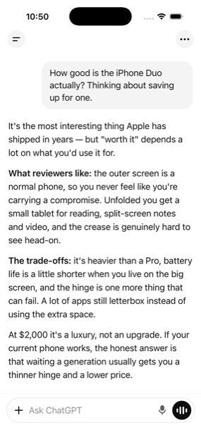
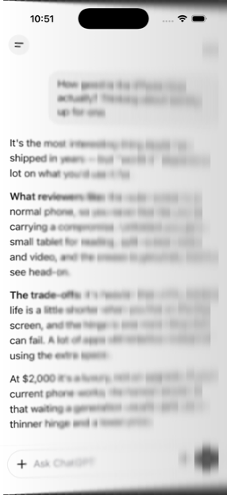
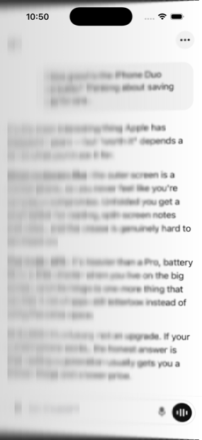
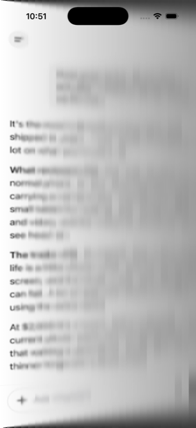
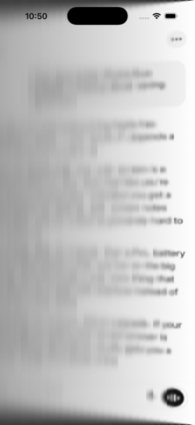
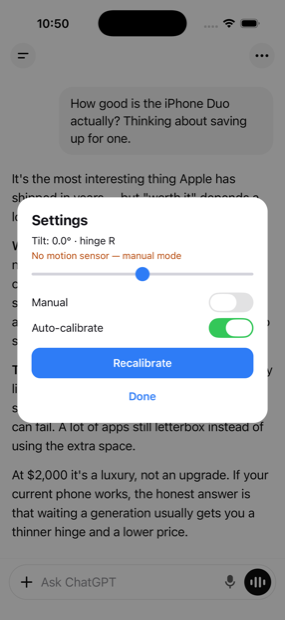

<h1 align="center">iphone-duo-expo-rn</h1>

<p align="center">
  <strong>The iPhone “Duo” frosted-glass fold, for any Expo app.</strong><br />
  Tilt the device and your whole UI becomes a sheet of glass hinged on its far edge —<br />
  lifting toward you, stretching in perspective, frosting and dimming as it goes.
</p>

<p align="center">
  <a href="https://www.npmjs.com/package/iphone-duo-expo-rn"></a>
  
  
  
  
  <a href="./LICENSE"></a>
</p>

<p align="center">
  
  
  
</p>

---

## Install

```bash
npx expo install iphone-duo-expo-rn
```

Then add whichever optional pieces you want. All three ship with the Expo SDK, and the
module works without any of them:

```bash
npx expo install expo-sensors expo-blur expo-linear-gradient
```

| Package | What it adds | Without it |
| --- | --- | --- |
| `expo-sensors` | The fold follows the device | Drive the tilt yourself with `setManualTilt()` |
| `expo-blur` | The frosted blur | Warp and dimming only |
| `expo-linear-gradient` | A smooth dimming ramp | Falls back to React Native gradients, then stepped bands |

Requires **Expo SDK 57+** (React Native 0.82+). Runs on iOS, Android and web — and inside
Expo Go, because there is no custom native code to link and no config plugin to add.

## Use

Wrap your app once, as high in the tree as you can.

### Expo Router

```tsx
// app/_layout.tsx
import { DuoFoldProvider } from 'iphone-duo-expo-rn';
import { Stack } from 'expo-router';

export default function RootLayout() {
  return (
    <DuoFoldProvider>
      <Stack />
    </DuoFoldProvider>
  );
}
```

Prefer to leave the layout component alone? Use the HOC:

```tsx
import { withDuoFold } from 'iphone-duo-expo-rn';

function RootLayout() {
  return <Stack />;
}

export default withDuoFold(RootLayout);
```

### Plain Expo app

```tsx
import { DuoFoldProvider } from 'iphone-duo-expo-rn';

export default function App() {
  return (
    <DuoFoldProvider>
      <YourApp />
    </DuoFoldProvider>
  );
}
```

### Control it

```tsx
import { useDuoFold, useDuoFoldStatus, useDuoFoldTilt } from 'iphone-duo-expo-rn';

function DebugPanel() {
  const fold = useDuoFold();
  const tilt = useDuoFoldTilt();             // sampled at 30 Hz by default
  const { hasSensor } = useDuoFoldStatus();

  return (
    <>
      <Text>{tilt.toFixed(1)}°</Text>
      <Button title="Recalibrate" onPress={fold.recalibrate} />
      <Button title="Hold at 30°" onPress={() => fold.setManualTilt(30)} />
      <Button title="Back to sensor" onPress={() => fold.setManualTilt(null)} />
      <Button title="Off" onPress={() => fold.setEnabled(false)} />
      {!hasSensor ? <Text>No motion sensor — manual only</Text> : null}
    </>
  );
}
```

`useDuoFold()` returns a stable controller, and reading from it never re-renders.

## Gallery

The fold resolves its hinge from the sign of the tilt — it is never pinned to one side.
The hinge edge stays sharp and anchored; everything away from it lifts, frosts and dims
in proportion to how far the glass has separated from the plane behind it.

<table>
  <tr>
    <td align="center" width="33%"><br /><sub><b>At rest — 0°</b><br />Untouched. Identity transform, overlays unmounted.</sub></td>
    <td align="center" width="33%"><br /><sub><b>Hinge left — 12°</b><br />Sharp at the hinge, frosting to the right.</sub></td>
    <td align="center" width="33%"><br /><sub><b>Hinge right — 12°</b><br />The hinge follows the tilt sign.</sub></td>
  </tr>
  <tr>
    <td align="center"><br /><sub><b>Hinge left — 30°</b><br />Magnification and crop grow with the angle.</sub></td>
    <td align="center"><br /><sub><b>Hinge right — 28°</b><br />Near the limit the glass is almost opaque.</sub></td>
    <td align="center"><br /><sub><b>Example controls</b><br />Manual tilt, recalibration, sensor toggle.</sub></td>
  </tr>
</table>

## Tuning

Every knob mirrors the original implementation, expressed in millimetres and
density-independent points instead of shader units.

```tsx
<DuoFoldProvider
  parameters={{
    eyeDistanceMillimeters: 450, // larger = flatter perspective, less cropping
    blurSpread: 0.12,            // blur radius gained per dp of glass/plane gap
    darkening: 0.015,            // light lost per dp of blur radius
    maxTiltDegrees: 45,
  }}
  motion={{
    smoothing: 0.7,              // fraction of the error closed per sample
    recenterTauSeconds: 15,      // how fast the zero pose washes drift away
  }}
  blurBands={28}                 // strips approximating the continuous blur ramp
  blurUpdateHz={30}
  missColor="#000000"            // what the glass absorbs toward, and what a miss shows
/>
```

`blurSpread` is the one to reach for first. The default is faithful to the original,
which is *strong* — past about 20° most of the screen is deliberately illegible. Halve it
to `0.06` for a subtler effect that stays readable at any angle.

## How it works

The original is a per-pixel AGSL shader. For each output pixel it treats the position as
arc length along the tilted glass, casts a ray from a fixed eye through that point onto
the UI plane behind, and samples there with a gap-proportional disk blur:

```
d     = |x - hingeX|                 // distance from the hinge, along the glass
glass = hingeX ± d · cos(tilt)       // the glass point, rotated about the hinge
gap   = d · sin(tilt)                // how far it lifted toward the eye
hit   = centre + (glass - centre) · E / (E - gap)
```

React Native has no per-pixel shader that can read the view tree behind it, so the effect
is decomposed into three layers it *can* express.

**Geometry — exact.** That per-pixel map is a homography, so its inverse is one too, and
it can be written in closed form as a scale, a rotation about the view's centre line under
a camera, and a screen-space offset:

```
θ  = |tilt|,  h = hinge · width/2
tx = h(cos θ - 1) / cos θ
K  = (E - width·sin θ/2 + tx·hinge·sin θ) / (E·cos θ)

perspective = K·E      rotateY = -tilt
scaleX      = K/cos θ  scaleY  = (E·cos θ - width·sin θ/2) / (E·cos θ)
translateX  = tx
```

None of that is a hand-rolled matrix, deliberately: Android decomposes transforms into
`rotationY` + `cameraDistance` + scale + 2D translation, so an arbitrary homography would
not survive the trip. Every value above stays inside the subset iOS, Android and web
reproduce identically. `solveFoldTransform()` is verified against the shader's own
projection to machine precision in the test suite.

**Dimming — exact.** The shader's `1 - darkening · radius` is linear in the distance from
the hinge, so a single static gradient per side, scaled by an animated opacity,
reproduces the entire curve.

**Blur — approximated.** A per-pixel variable-radius blur has no React Native equivalent,
so the ramp is quantised into `blurBands` backdrop-blurred strips. Blur is a
low-frequency cue, so the strips re-render at `blurUpdateHz` rather than at sensor rate.
This is the one place where the port is a likeness rather than a reproduction.

Every value the renderer needs is a smooth function of the signed tilt, so it is baked
once per layout into `Animated` interpolation tables driven by a single `Animated.Value`.
A new sensor sample updates the views' native props directly: the geometry is never
re-solved, React never re-renders, and the wrapped app never learns that the device moved.
No `react-native-reanimated` required.

The motion model ports the original's sensor fusion: a calibrated zero pose, screen-axis
remapping that honours display rotation, rotation-rate prediction to cover sensor latency,
a light low-pass, and a slow washout that absorbs drift while the device is still. On web,
where `expo-sensors` reports no fused attitude, it integrates the rotation rate instead
and lets the washout hold the zero.

## Notes and limits

- **The blur is banded, not per-pixel.** Raise `blurBands` for a smoother ramp at the cost
  of more views, or pass `blurEnabled={false}` to drop it.
- **Content in its own window is not folded.** React Native `Modal`s, native alerts and
  system UI draw outside the provider's view, so they stay flat — usually what you want
  for a settings sheet.
- **Touch targets move with the pixels.** Hit-testing follows the transform on every
  platform, so taps land where things look; at large tilts, that is a long way from where
  they were laid out.
- **No permission prompt on iOS or Android.** The effect uses CoreMotion attitude and the
  Android rotation vector, neither of which is gated, so the module never calls
  `requestPermissionsAsync()` on its own — asking would raise a Motion & Fitness prompt it
  does not need. On web, call `useDuoFold().requestPermissions()` from a user gesture.
- **Android needs a blur backend.** `expo-blur` renders a plain translucent view on
  Android unless told otherwise; this module passes `blurMethod="dimezisBlurViewSdk31Plus"`
  by default. Override it with the `blurMethod` prop.
- **Simulators have no motion sensors.** `useDuoFoldStatus().hasSensor` reports `false`;
  drive `setManualTilt()` from a slider instead. The example app ships one.

## API

| Export | What it is |
| --- | --- |
| `DuoFoldProvider` | Wraps an app in the fold; owns the sensor |
| `withDuoFold(Component, config?)` | The same thing as an HOC |
| `DuoFoldView` | The renderer, for folding one subtree under an existing provider |
| `useDuoFold()` | Stable controller: `recalibrate`, `setManualTilt`, `setEnabled`, `setAutoRecenterEnabled`, `requestPermissions`, `getState`, `subscribe` |
| `useDuoFoldTilt(hz?)` | Live tilt in degrees |
| `useDuoFoldStatus()` | `{ hasSensor, source, enabled }` |
| `useDuoFoldState(selector, hz?)` | Any slice of the state |
| `solveFoldTransform()` | The closed-form transform, if you want to drive it yourself |
| `foldBlurRadiusDp()` · `foldDarkenAlpha()` · `foldBlurStrength()` | The blur and dimming curves |
| `FoldMotionModel` | The sensor fusion, with platform plumbing lifted out |
| `DuoFoldEngine` | Sensor subscription plus animated tilt value |

## Example app

```bash
cd example
npx expo install
npx expo run:ios     # or: npx expo run:android
```

The example puts a ChatGPT-style transcript under the fold — long-form text on near-white
is the least forgiving surface there is, so every degree of perspective and every seam in
the blur ramp shows. The overflow (`···`) button opens the controls in the screenshots
above; on a simulator, the slider is how you drive it.

## Contributing

```bash
npm install
npm run lint
npm test
npm run build
```

The geometry is covered by property-style tests that check the solver against the
reference projection across eye distances, tilts and hinge sides. If you change
`foldGeometry.ts`, those should stay green without loosening a tolerance.

## Author

**Binni Cordova** — 8 years building production mobile and web software.

I like problems like this one: take an effect that “needs” a shader, find the maths that
makes it expressible in primitives every platform already has, and ship it as something
another developer can install in one line.

- 🌐 [binnicordova.com](https://binnicordova.com)
- 💼 [github.com/binnicordova](https://github.com/binnicordova)

Available for React Native, Expo and TypeScript work.

## License

MIT © [Binni Cordova](https://binnicordova.com)
